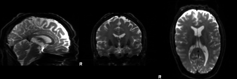
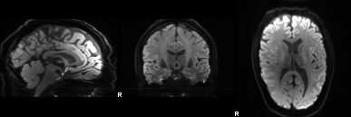
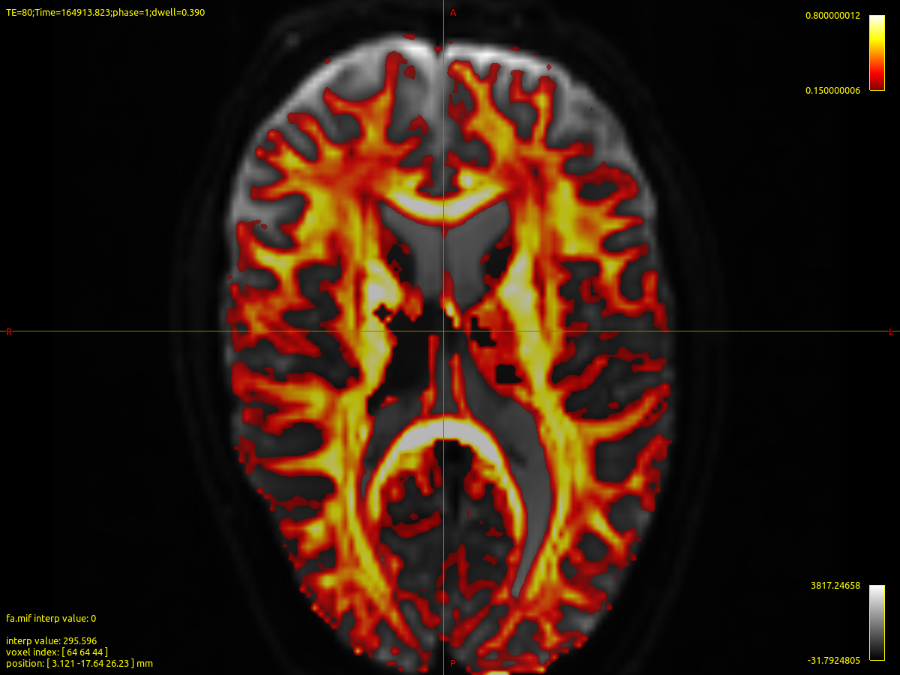
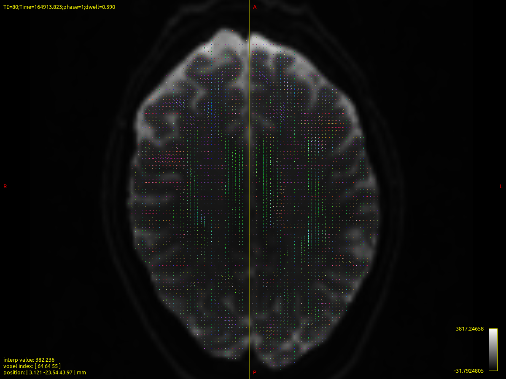
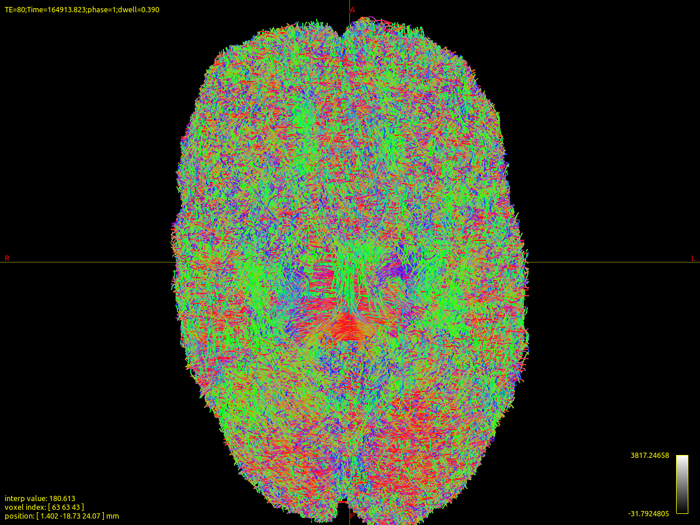
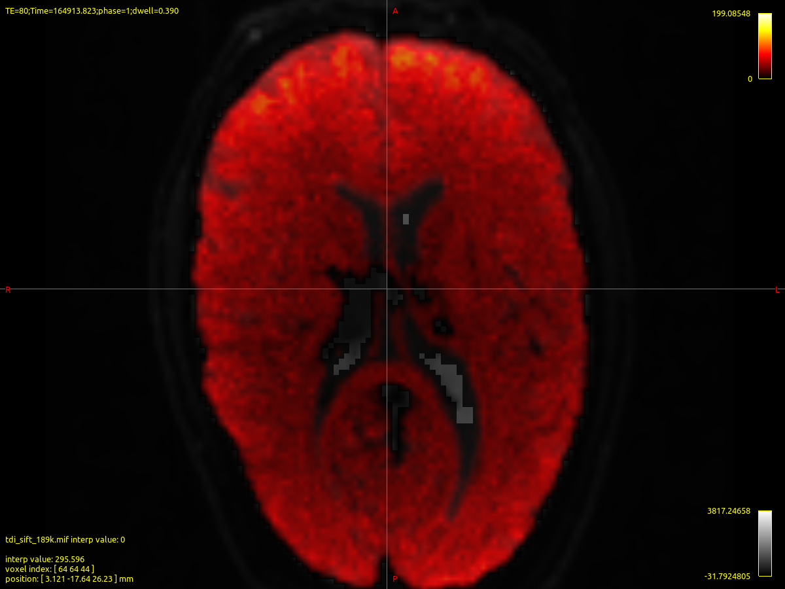

# Diffusion MRI: MRtrix3 + FSL single-subject workflow

Reproducible single-subject diffusion MRI workflow combining **MRtrix3** and **FSL** for preprocessing, diffusion tensor imaging, constrained spherical deconvolution, whole-brain tractography, SIFT filtering, quantitative summaries, and visual quality control.

## Dataset

- Public MPI-LEMON diffusion MRI data
- Subject: `sub-010142`
- Session: `ses-01`
- Matrix: `128 × 128 × 88 × 67`
- Resolution: `1.71875 × 1.71875 × 1.7 mm`
- Shells: 7 volumes near `b=0` and 60 directions near `b=1000 s/mm²`
- Phase-encoding direction: `j-`
- Total readout time: `0.04914 s`

Raw imaging data and large derivatives are intentionally excluded from Git.

## Workflow

1. NIfTI, b-values, b-vectors, and JSON imported into MRtrix format.
2. MP-PCA denoising with `dwidenoise`.
3. Gibbs-ringing correction with `mrdegibbs`.
4. Motion, eddy-current, and outlier correction with `dwifslpreproc` and FSL Eddy.
5. Brain-mask generation with `dwi2mask`.
6. Tensor fitting and FA, MD, AD, and RD calculation.
7. Single-shell white-matter response estimation and CSD.
8. Whole-brain probabilistic iFOD2 tractography.
9. SIFT filtering and track-density imaging.
10. Automated QC figures and tabular summaries.

The acquisition does not contain reverse phase-encoding data. Therefore, preprocessing used `-rpe_none`; susceptibility distortion correction with TOPUP was not possible.

## Main quantitative results

| Measure | Result |
|---|---:|
| Mean FA | 0.242333 |
| Median FA | 0.187218755 |
| Mean MD | 0.00108871 mm²/s |
| Median MD | 0.000789097568 mm²/s |
| Mean AD | 0.00132175 mm²/s |
| Mean RD | 0.000972186 mm²/s |
| Initial tractogram | 500000 streamlines |
| SIFT-filtered tractogram | 189356 streamlines |
| Display tractogram | 20000 streamlines |
| SIFT μ | 0.0295905 |

Global tensor summaries were calculated inside the whole-brain DWI mask and are descriptive, not normative or diagnostic.

## Quality-control figures

### EddyQC mean b=0



### EddyQC mean b=1000



### Fractional anisotropy



### Fiber orientation distributions



### Whole-brain tractography



### Track-density image



## Repository structure

```text
.
├── docs/
│   ├── METHODS.md
│   └── RESULTS.md
├── env/
│   └── TOOL_VERSIONS.md
├── reports/
│   └── eddy_qc_sub-010142.pdf
├── results/
│   ├── figures/
│   └── tables/
└── scripts/
    ├── run_dwi_pipeline.sh
    ├── prepare_dwi_portfolio_outputs.sh
    └── make_mrview_figures.sh
```

## Reproduction

Review and adapt the path variables at the beginning of:

```bash
scripts/run_dwi_pipeline.sh
```

Then run:

```bash
chmod +x scripts/run_dwi_pipeline.sh
./scripts/run_dwi_pipeline.sh
```

The script expects the raw DWI NIfTI, b-value, b-vector, and JSON files in the external working directory documented in the script.

## Limitations

- Single subject.
- Single-shell diffusion acquisition.
- No reverse phase-encoding acquisition for TOPUP.
- Whole-brain mask statistics combine multiple tissue classes.
- Tractography is model-dependent and does not demonstrate direct anatomical connectivity.
- Automated figures should still receive visual review before interpretation.

## Software environment

See [env/TOOL_VERSIONS.md](env/TOOL_VERSIONS.md).

## Author

**Rene Andrade Rey**  
ORCID: 0000-0001-5627-579X
