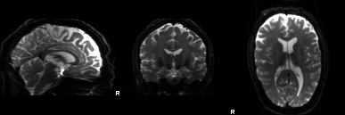
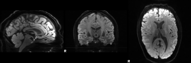
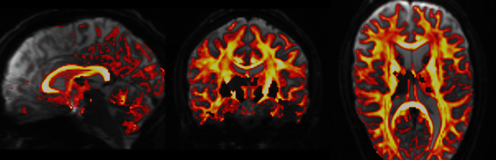
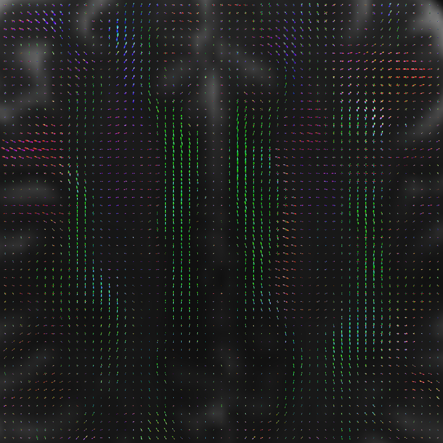
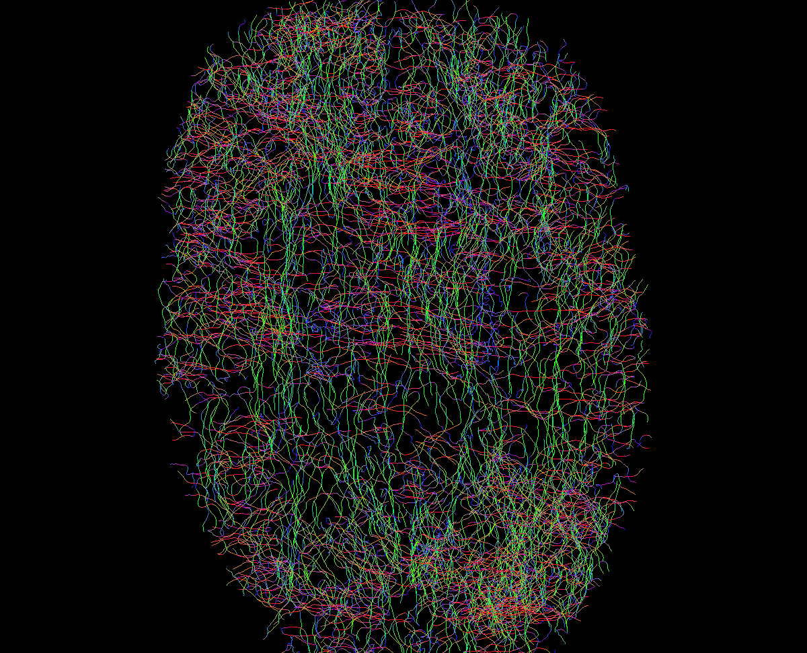

# Diffusion MRI: MRtrix3 + FSL single-subject workflow

Reproducible single-subject diffusion MRI workflow combining **MRtrix3** and **FSL** for preprocessing, diffusion tensor imaging, constrained spherical deconvolution, whole-brain tractography, SIFT filtering, quantitative summaries, and visual quality control.

## Dataset

- Public MPI-LEMON diffusion MRI data
- Subject: `sub-010142`
- Session: `ses-01`
- Matrix: `128 × 128 × 88 × 67`
- Resolution: `1.71875 × 1.71875 × 1.7 mm`
- Shells: 7 volumes near `b=0` and 60 directions near `b=1000 s/mm²`
- Phase-encoding direction: `j-`
- Total readout time: `0.04914 s`

Raw imaging data and large derivatives are intentionally excluded from Git.

## Workflow

1. NIfTI, b-values, b-vectors, and JSON imported into MRtrix format.
2. MP-PCA denoising with `dwidenoise`.
3. Gibbs-ringing correction with `mrdegibbs`.
4. Motion, eddy-current, and outlier correction with `dwifslpreproc` and FSL Eddy.
5. Brain-mask generation with `dwi2mask`.
6. Tensor fitting and FA, MD, AD, and RD calculation.
7. Single-shell white-matter response estimation and CSD.
8. Whole-brain probabilistic iFOD2 tractography.
9. SIFT filtering and track-density imaging.
10. Automated QC figures and tabular summaries.

The acquisition does not contain reverse phase-encoding data. Therefore, preprocessing used `-rpe_none`; susceptibility distortion correction with TOPUP was not possible.

## Main quantitative results

| Measure | Result |
|---|---:|
| Mean FA | 0.242333 |
| Median FA | 0.187218755 |
| Mean MD | 0.00108871 mm²/s |
| Median MD | 0.000789097568 mm²/s |
| Mean AD | 0.00132175 mm²/s |
| Mean RD | 0.000972186 mm²/s |
| Initial tractogram | 500000 streamlines |
| SIFT-filtered tractogram | 189356 streamlines |
| Display tractogram | 800 streamlines |
| SIFT μ | 0.0295905 |

Global tensor summaries were calculated inside the whole-brain DWI mask and are descriptive, not normative or diagnostic.

Tensor-validity QC identified 0.0149642% of DWI-mask voxels with FA > 1 and/or negative diffusivity. Excluding these voxels changed each reported mean by less than 0.05%, so the primary descriptive values remain the full-mask results. Detailed QC is provided in `results/tables/table3_tensor_validity_qc.tsv` and `results/tables/table4_dti_sensitivity.tsv`.

During SIFT, the requested termination target was 100,000 streamlines, but the completed run terminated at 189,356 streamlines. The final recorded iteration removed no additional streamlines. The repository therefore reports the actual SIFT output rather than the requested target.

## Quality-control figures

### EddyQC mean b0



### EddyQC mean b1000



### Fractional anisotropy

The final FA figure shows sagittal, coronal, and axial views. FA is displayed as an overlay on the mean b0 image so that anatomical context remains visible outside high-FA regions.



### Fiber orientation distributions

The FOD figure provides an orientation-resolved visualization from the white-matter FOD model.



### Whole-brain tractography

The presentation figure uses an 800-streamline display-only subset of the SIFT-filtered tractogram. This subset is used only for visual clarity and does not replace the full SIFT result of 189356 streamlines.



The track-density image remains a derived output of the scientific workflow but is not included among the primary portfolio figures because the tested static renderings did not add clear visual information beyond the retained tractography and FOD figures.

## Repository structure

```text
.
|-- docs/
|   |-- METHODS.md
|   `-- RESULTS.md
|-- env/
|   `-- TOOL_VERSIONS.md
|-- reports/
|   `-- eddy_qc_sub-010142.pdf
|-- results/
|   |-- figures/
|   `-- tables/
`-- scripts/
    |-- run_dwi_pipeline.sh
    |-- prepare_dwi_portfolio_outputs.sh
    `-- make_mrview_figures.sh
```

## Reproduction

Set `WORK` to the external DWI work directory before running the pipeline. The repository path is detected automatically; `RAW`, `DERIV`, and `SCRATCH` may also be overridden when needed.

```bash
export WORK=/path/to/external/dwi-work
scripts/run_dwi_pipeline.sh
```

Raw DWI NIfTI, b-value, b-vector, and JSON files are expected under the default subject/session layout inside `WORK`, unless `RAW` is explicitly overridden.

## Limitations

- Single subject.
- Single-shell diffusion acquisition.
- No reverse phase-encoding acquisition for TOPUP.
- Whole-brain mask statistics combine multiple tissue classes.
- Tractography is model-dependent and does not demonstrate direct anatomical connectivity.
- Automated figures should still receive visual review before interpretation.

## Software environment

See [env/TOOL_VERSIONS.md](env/TOOL_VERSIONS.md).

## Author

**Rene Andrade Rey**  
ORCID: 0000-0001-5627-579X
